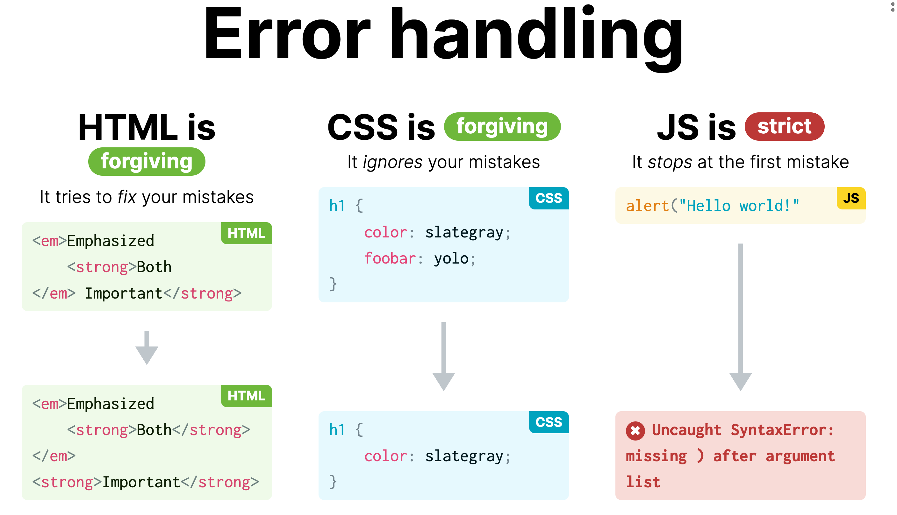
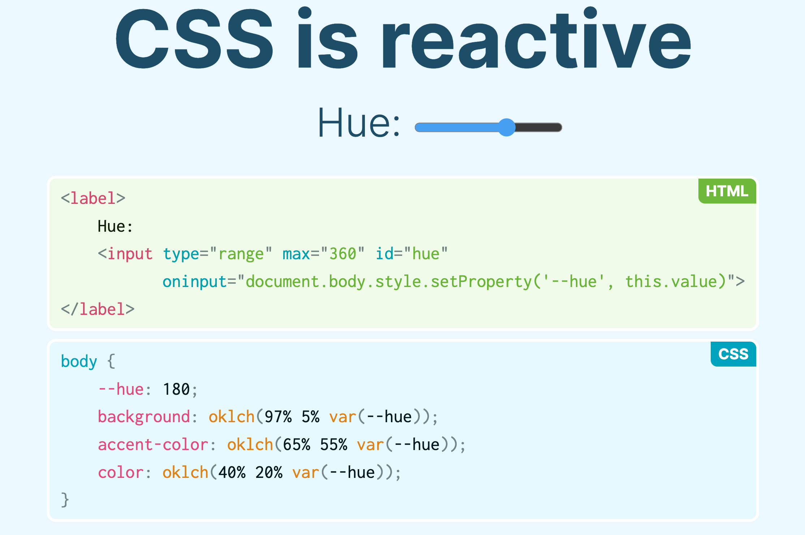
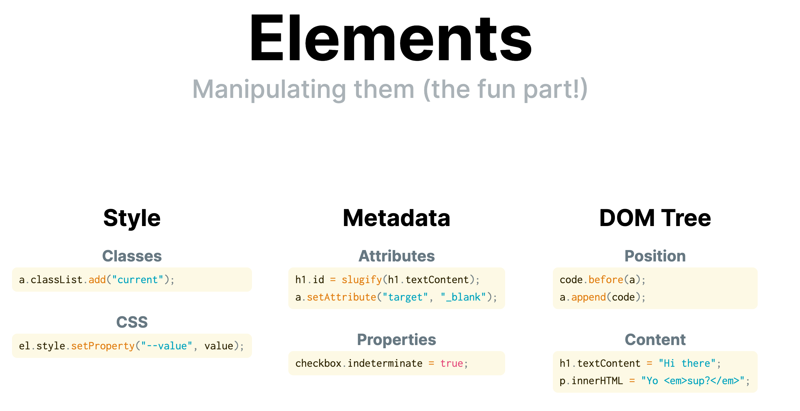
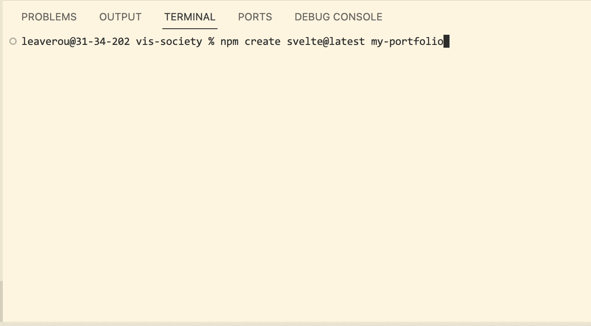
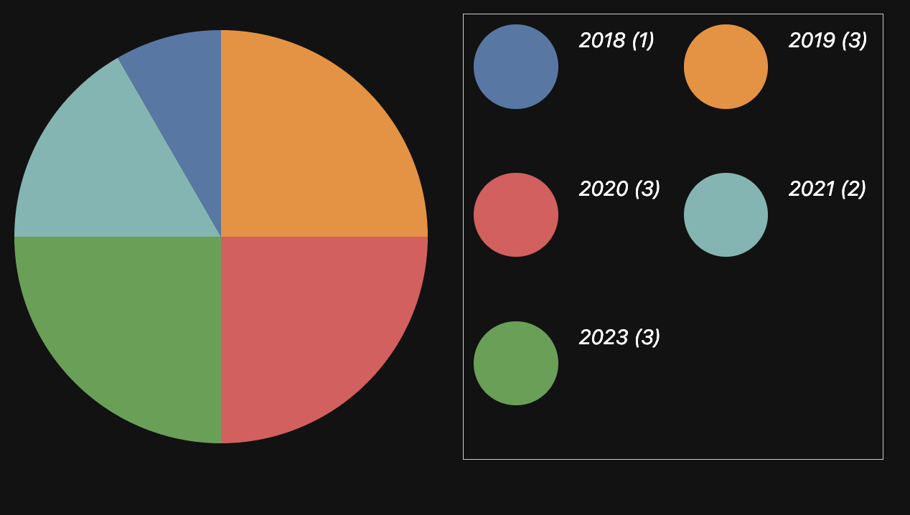
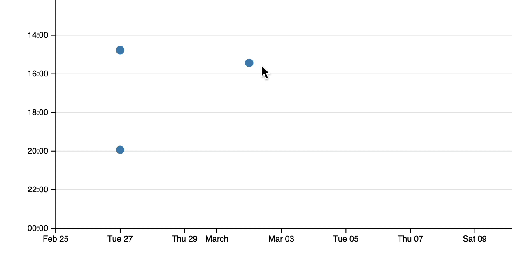

# Notes
These are useful concepts to follow a successful carreer in data visualization. Taken from the course [vis-society](https://vis-society.github.io/) from MIT.
All the lab progress are in the commits.

# Table of Contents
- [Setup](#lab-0-setup)
- [1. Introduction to the Web platform](#lab-1-introduction-to-the-web-platform)
- [2. Styling with CSS](#lab-2-styling-with-css)
- [3. Introduction to JS](#lab-3-introduction-to-js)
- [4. Svelte (Templating & Control Flow)](#lab-4-svelte-templating--control-flow)
- [5. Svelte II (Loading Data & Reactivity)](#lab-5-svelte-ii-loading-data--reactivity)
- [6. Visualizing categorical data with D3](#lab-6-visualizing-categorical-data-with-d3)
- [7. Visualizing quantitative data with D3](#lab-7-visualizing-quantitative-data-with-d3)

## Lab 0. Setup
Installation of tools:
- Install *VS Code* and basic extensions
- Learn *git* commands and *Github*
- Learn how to use *Node.js* and *npm*
- Install extension *Live Server* in VS Code
- Install extension *for Svelte* in VS Code

## Lab 1: Introduction to the Web platform
This is a starting point of web development
### 1.1 Some Web fundamentals
- Other useful courses are [6.813/6.831: User Interface Design & Implementation](https://web.mit.edu/6.813/www/sp18/) and [6.S063 Design for the web: Languages and User Interfaces](https://designftw.mit.edu/)
- Relative URL concepts:
	 If a relative URL starts with a `'/'`, it is relative to the root of the host. `..` means "go up one level" and `.` refers to the current directory.
- Going through web development, remember that it is possible to have `<script>` elements without type="module", but we recommend you always use type="module" as it enables a few modern JS features and prevents certain errors.
- Error handling in web development

- HTML cheatsheet


### 1.2 Creating our own website from scratch and publishing it on the Web
Create a simple website and publish in GitHub. It should have: introduction text, a photo, some style, a navigation menu and forms.

## Lab 2: Styling with CSS
### Slides
- Every HTML element produces a box
- CSS concepts
`display:flex` or `display:grid`

- HTML pages are trees

- Styling

- Targeting

- Pseudo classes

- Reactivity

- If there is a duplicate declaration in CSS, the last one wins!
- Even if you don't apply any CSS to your page, the browser will do.
- Being specificitty


### Lab
Style your project page
- Use css for styles
- Use responsive Grid

svelte-portfolio/static/style.css
```
.projects {
  display: grid;
  grid-template-columns: repeat(auto-fill, minmax(15em, 1fr));
}
```
- Use an Horizontal alignment with subgrid

svelte-portfolio/static/style.css
```
 article {
    grid-template-rows: subgrid;
    grid-row: span 1;
  }
```

## Lab 3: Introduction to JS
### Slides
- JS is a language that runs in the browser (but can also run on the server, in native applications, etc.)
- The console for debugging 

A useful command to interact with dev tools is `$$` which give you a list of elements matching a selector
```
$$("*").length
```
Video
<video src="./static/images/3-js-console.mp4" autoplay muted loop></video>
- Read about JS data types and object properties
- In addition to object properties, their values can be functions

- Reference elements


- Events


### Lab
- Add a JS file (global.js) to all pages
- Add an automatic current page link
- Add an automatic navigation menu  
From an array pass data to set the nav links
- Highlighting the current page and opening external links in a new tab
- Adding HTML for the dark mode switch, placed it at the top right corner, and use event Listeners to obtain the value of UI `select` control when it changes.
- Saving the user’s preference to keep the schemeColor in other pages
`localStorage.colorScheme = event.target.value`

## Lab 4: Svelte (Templating & Control Flow)
### Slides
- *npm* is a package manager such as *pip* or *brew*
- Build process

- Traditional architecture

- Component base Architecture (cba)

- Components

- Svelte
Performance, Less client-side JS and Easier syntax


### 4.1: Setting up
Create a vis project


```
$ npm create svelte@latest my-portfolio

$ npm install && npm install -D svelte@next && npm install -D @sveltejs/adapter-static
```
Start the server 
```
npm run dev -- --open
```

To create a production version of your local app:

```
npm run build
```

You can preview the production build with `npm run preview`.

Something to know

```bash
FYI
What does these commands lines do? 

npm install: reads dependencies from package.json and installs the packages listed there.

npm install -D svelte@next: will replace the Svelte version already installed with the latest pre-release version (which we need for modern CSS support).

npm install -D @sveltejs/adapter-static: will install the static adapter for SvelteKit, which we will use to deploy our website to GitHub Pages
```


> **Warning**: To deploy your app, you may need to install an [adapter](https://kit.svelte.dev/docs/adapters) for your target environment.

### 4.2: Porting your previous website to Svelte
- First, copy your images/ folder as well as style.css and global.js to static/
- Adjust src/app.html to read upper files
- Porting your pages to routes:

projects/index.html → routes/projects/+page.svelte

cv/index.html → routes/cv/+page.svelte

contact/index.html → routes/contact/+page.svelte

- Adding titles with `<svelte:head>` element
- Adjusting navigation bar URLs, delete the trailing slash at the end of your relative URLs in global.js.

### 4.3: Publishing our new website to GitHub Pages
Add and edit these files in your project then push to deploy

`.github/workflows/deploy.yml` (https://vis-society.github.io/labs/4/download/deploy.yml)

`svelte.config.js` (https://vis-society.github.io/labs/4/download/svelte.config.js).

**Warning**: Add if neccesary a .env file with BASE_PATH=/svelte-portfolio 
to avoid, strange things

### 4.4: Templating projects from a data file

- Move your data projects to /src/lib/projects.json

Useful code to extract data from dev tools. Put it in the console log
```
$$(".projects > article").map (a => ({
	title: $('h2', a).textContent,
	image: $("img", a).getAttribute("src"),
	description: $("p", a).textContent,
}));
```
- Load your data in src/routes/projects/+page.svelte
- Be able to indicate the total count of projects

### 4.5: Displaying the first 3 projects on the home page
- Create and use **Project** component.

This line is useful only to declare a prop variable
In Project.svelte
```
export let data = {};
```
Project.svelte goes into components folder

- Showing the latest projects on the home page

Use the `<Project>` component to  show the lastest 3 with *slice*

svelte-portfolio/src/+page.svelte
```
<h1>
  Latest Projects
  <div class="projects">
    {#each projects.slice(0, 3) as p}
      <Project data={p} hLevel="3" />
    {/each}
  </div>
</h1>
```

- Customizing heading levels

Set the hierarchy of the component using props and move styles from svelte-portfolio/static/style.css to the component itself in `<style>` element.

### 4.6: Creating a layout for UI shared across pages
Create a Layout for nav.
- An app has multiple layouts generally. In our case is there is a layout for the app.html.
- The convention to create a layout component is `+layout.svelte`
- Move part of the code from `global.js` to `+layout.svelte`
- Must be placed `<slot />` inside the layout,  the page is gonna to be displayed inside it.
- Use `$page` from `$app/stores` to load page properties and detect the current page link. 
- The layout could have its own styles.

## Lab 5. Svelte II (Loading Data & Reactivity)
### Slides
- Reactivity is recalculating things when an event occurs.
- CSS is Reactive. Change a CSS variable via JS
- JS is not reactive. You have to do it with event listeners
- For reactivity in svelte do:

`$` recalculates when dependencies change and
`bind:value={a}` updates the UI when the input changes
```
<script>
	let a = 1, b = 2, c;
	$: c = a + b;
</script>

<input type="number" id="a" bind:value={a}> +
<input type="number" id="b" bind:value={b}> =
<input type="number" id="c" bind:value={c} disabled>
```


### 5.1 Port the theme switcher to Svelte (Dark/Light theme)
*Concepts*

- “Bind” in this context means that the value of the variable will be automatically updated when the value of the `<select>` changes, and vice versa.

- Html tag is not part of the svelte technology. So that's is for *document* is undefined and  `console.log(document)` throws an error `500 internal error`. 

Explanation: 

`Our Svelte code is first ran in Node.js to generate the static parts of our HTML, and the more dynamic parts make it to the browser. However, Node.js has no document object, let alone a document.documentElement object`

- When accessing properties of objects of questionable existence, we can use the optional chaining operator **?**. instead of the dot operator to avoid errors

set colorScheme variable to the "color-scheme" property in the document 
```
let root = globalThis?.document?.documentElement;
$: root?.style.setProperty("color-scheme", colorScheme);

```

- Use $ for reactivity statement

- Save the color-scheme to localStorage and get it again to keep the theme switcher in other pages 
```
let localStorage = globalThis.localStorage ?? {};

$: localStorage.colorScheme = colorScheme;

```

- Preventing FOUC (Flash of Unstyled content) add the `script` code to the app.html
A strange behavior when theme changes after the page has loaded

This code set the theme before the page has loaded. 

app.html 
```
<script type="module">
	let root = document.documentElement;
	let colorScheme = localStorage.colorScheme ?? "light dark";
	root.style.setProperty("color-scheme", colorScheme);
</script>
```

### 5.2 Loading data from an API
Images of the results

- Use an API to extract github stats data. An example from `https://api.github.com/users/your-username`
- *fetch* is an example of an asynchronous function. This means that it does not return the data directly, but rather a Promise that will eventually resolve to the data. In fact, fetch() returns a Promise that resolves to a Response object, which is a representation of the response to the request. To get meaningful data from a Response object, we need to call one of its methods, such as json(), which returns a Promise that resolves to the JSON representation of the response body.

Extract a promise
```
  let promise = fetch("https://api.github.com/users/leaverou").then(
    (response) => response.json(),
  );
```

- Use the `#await`block for managing promises

syntax 
```
{#await promise}
	Loading...
{:then data}
	The data is {data}
{:catch error}
	Something went wrong: {error.message}
{/await}
```
- Use `<dl>`, `<dt>` and `<dd>` tags and styles to custom display information like the picture.
- Update the year of your projects.

## Lab 6: Visualizing categorical data with D3
### Slides
No slides but useful information for this lab
- [Material](https://vis-society.github.io/lectures/intro-svelte-d3.html)
- [59 different examples as reusable templates.](https://observablehq.com/collection/@d3/charts)
- [Convert into svelte + d3.js format](https://svelte.dev/repl/4cc901a472a54219974552ee2b71fefd?version=4.2.18)
- Create a more sophisticated component so, for instance `<Sunburst {data} width=1152 height=1152 />` instead of `Sunburst(data, {width: 1152, height: 1152, ...})`

### 6.0 Show year in each project
- Add some description to projects.json
- Add the year of the article
- Style the article

#### 6.1.0: Creating a pie chart with D3
- Create a Pie.svelte component
- Create a circle svg

#### 6.1.1 Drawing our circle path with D3
- Use of the powerful `<path>` element to draw a circle
- Use of the `d3.arc()` function to generate the path for our circle and update the *d* value in `<svg`. Change `innerRadius(r)`, where `r` is the radius of the innercircle if you want a donut chart.
- Prepare your data and then pass it to arcgenerator.
- Pass colors to the pie


#### 6.1.2 More colors to the pie
- Instead of generating the start and end angles for each slice for ourselves, use the `d3.pie()` function .
- For categorizing data use `scaleOrdinal` with `d3.schemeTableau10` to generate a color function and change the path property value `colors[i]` by `color(i)` because this is a function now.


### 6.2 Adding a legend
#### 6.2.1 Adding labels to our data

#### 6.2.2 Adding a legend
- Add the legend code
- `<span>` is an inline element by default, so to get widths and heights to work you need to set this in the parent
```
span {
    display: inline-block;
  }
```
- Be careful to follow the steps
- Correct the `span`circles, they are too big


#### 6.2.3 Laying out our pie chart and legend side by side
- Use a container to control the svg and the legend
- Add div css

<video src="./static/images/middle/6-visualizing-responsive-legend.mp4" autoplay muted loop></video>

### 6.3 Plotting our actual data

- Make data a prop of the component
- Summarize data with d3.rollups which throws 
```
[
	[ 2023, 3 ],
	[ 2021, 2 ],
	[ 2020, 3 ],
	[ 2019, 3 ],
  [ 2018, 1 ]
]
```
- Transform array of arrays to an array of objects with map. This throws
```
[
	{ value: 3, label: 2023},
	{ value: 2, label: 2021},
	{ value: 3, label: 2020},
	{ value: 3, label: 2019},
  { value: 1, label: 2018}
]
```
Results


### 6.4: Adding a search for our projects

- 6.4.1 Add an `<input type="search">` for basic search functionality showing only visible projects
<video src="./static/images/middle/6-search-titles.mp4" autoplay muted loop></video>

- 6.4.2 Make search case-insentive and search across all project metadata not just titles. We can use the `Object.values()` function to get an array of all the values of a project.

- 6.4.3 Visualizing only visible objects with the use of reactivity in variables that change in the page and in the component. You can use multiple reactivity commands with `{}`.

<video src="./static/images/middle/6-search-pie-reactive.mp4" autoplay muted loop></video>

### 6.5: Turning the pie into filtering UI
Worked more on interactive visualizations

- SVG elements are still DOM elements so they can be styled with regular CSS but the available properties are not the same.

- 6.5.1 Highlighting hovered wedge. It is important to add another svg style to avoid a huge pie.


- 6.5.2: Highlighting selected wedge

Build a selected wedge and a selected legend with a click. The point is to catch the sector of the pie, add a conditional `selected` class and then manipulate by CSS.

<video src="./static/images/middle/6-UIFilter-wedge-select.mp4" autoplay muted loop></video>

- 6.5.3 Filtering the projects by the selected year

Filtering the projects by clicking the pie or legend. So, hold the selected index (`selectedYearIndex`) and bind it to the `<Pie>` component's `selectedIndex` prop. 
Then define reactive variables to hold the selected year (`selectedYear`) and filter the projects (`filteredByYear`), use this to display them.
<video src="./static/images/middle/6-UIFilter-year-filter-final.mp4" autoplay muted loop></video>

- 6.5.4 Fixing accessibility issues

These issues are related to `path` and `span` elements:  

> Visible, non-interactive elements with a click event must be accompanied by a keyboard event handler... 

or 

> ... with a click handler must have an ARIA role


To fix them, make them focusable changing attributes like `tabindex="0"`, expose it as a button `role="button"` and use a custom event listener called `toggleWedge`.

An unexpected rectangular line will appear, hide it with `outline:none`.

Finally modify the svg because keyboard users have no way to know which wedge they have currently focused, which is a terrible user experience.

- 6.5.5: Better selected wedge styling (optional)

IMPORTANT about SVG: Shapes are painted in the order they appear in the source code, and unlike in HTML, there is no way to change this order with CSS. So decorations like *strokes* or *shadows* will work nicely for one of the wedges and fail miserably for the others.
Look after!

## Lab 7: Visualizing quantitative data with D3

No slides

### 7.0 Setting up
- Adding a new page with meta-analysis of the code in our project
- Install [elocuent](https://github.com/LeaVerou/elocuent) which is a code analysis script. Its output is a loc.csv file
- Setting it up so that the CSV file is generated on every build.
We also make sure our build environment in `deploy.yml` has access to all Git history. `fetch-depth: '0'` tells GitHub actions to fetch all history for all branches and tags via `actions/checkout@v4`.
- Exclude CSV from committed files

### 7.1 Displaying summary stats
####  7.1.1: Reading the CSV file in D3

`onMount` runs after the DOM and d3.csv is used to import the csv file

#### 7.1.2: Computing commit data

Sumarizing per commit, computing aditional keys and using `Object.defineProperty` to add a property key containig the raw data at the end of the object. 


#### 7.1.3: Use aggregations
Aggregate stats with group, max, rollups
- files: `d3.group(lines, (d) => d.file).size`
- maxDepth: `d3.max(lines, (d) => d.depth)`
- fileLengths: `d3.rollups(
    data,
    (v) => d3.max(v, (v) => v.line),
    (d) => d.file,
  )
`

### 7.2 Visualizing time and day of commits in a scatterplot
Set plot core dimensiones width, height and margins according to rule conventions.

Set scales of x and y domains.

Add `circle` element and sets their positions using these scales.

Divide the plot into *svg* groups `g` for "dots", "axisX" and "axisY".

Use `transfom`property of `g` element to translate both axis.

Adjust the axisY to look like hours, it use `string.padStart()` which formats it as a two digit number and finally, we append ":00" to it to make it look like a time.

Add horizontal grid lines, this time with no text and use the `axis.tickSize()` method to make the lines extend across the whole chart

```
d3.select(yAxisGridlines)
  .call(d3.axisLeft(yScale)
	  .tickFormat("")
		.tickSize(-usableArea.width))
```

### 7.3: Adding a tooltip 
#### 7.3.1 Basic tooltip
 Use a `hoveredIndex` reactive variable to hold the index of the hovered commit. It holds the data we want to display in the tooltip.

 Add `mouseenter` and `mouseleave` event listeners inside the scatter plot circles.

 Add a class `info` to do some styling with `<dl>`, `<dt>`, and `<dd>` elements.

 *fixed* means relative to the viewport and *absolute* means relative to its nearest ancestor. An example 

 ```
.tooltip {
    position: fixed;
    top: 1em;
    left: 1em;
  }
```
Animations
```
circle {
    transition: 10ms;           // <- play with transition

    &:hover {
      transform: scale(1.5);    // <- expand the dot scale
      transform-origin: center; // <- fix hover weirdness thing (appears when you translate a visible object to a different position of the default top-left coordinate system, like a tooltip for example)
      transform-box: fill-box;  // <- fix weirdness thing(works in conjunction with the property above)
    }
  }
```
hovered weirdness


hovered fixed


#### 7.3.2 Making it look like a tooltip
Style the tooltip with this properties `background-color`, `box-shadow`, `border-radius`, `backdrop-filter` and `padding`.

Making only appear when we are hovering over a dot by using the [hidden](https://developer.mozilla.org/en-US/docs/Web/HTML/Global_attributes/hidden) attribute 

```
<dl class="info" hidden={hoveredIndex === -1}>
```

and then use this attribute in css for hidding and transition  effects.

```
dl.info {
	/* ... other styles ... */
	transition-duration: 500ms;
	transition-property: opacity, visibility;

	&[hidden]:not(:hover, :focus-within) {
		opacity: 0;
		visibility: hidden;
	}
}
```
Results
<video src="./static/images/7-tooltip-showhide.mp4" autoplay muted loop></video>

#### 7.3.3 Positioning the tooltip near the mouse cursor
Position the tooltip with the mouse based position using events. So in `circle` *mouseenter* event get the `event.x` and `event.y` pixel coordinates and pass them to tooltip inside `dl` element

```
<dl class="info" hidden={hoveredIndex === -1} style="top: {cursor.y}px; left: {cursor.x}px">
```

<video src="./static/images/7-tooltip-cursor.mp4" autoplay muted loop></video>

> Usually avoid setting <u>default</u> CSS properties. So do settings directly like *style* in `dl` element.  

#### 7.3.4 Bulletproof positioning (optional-Not completed)
The tooltip built only works if the mouse is near the center of the viewport. Near the edges the tooltip fails and it shows cutten. Here is an image of a cutten tooltip.


The solution is really complicated, it is better to save our time using a tool called **@floating-ui/dom**. So install it!. This works only with DOM elements.

Move event listeners code to `dotInteraction (index, event)` async function

`bind:this` is a way to assign an element to a variable

Fix accesibility issues, like tabindex, role etc

### 7.4: Communicating lines edited via the size of the dots (optional)
Add the *number of lines* as a third variable and map to the radius size. 

Create a scale using `d3.scaleSqrt()` method and apply some opacity to dots.

Linear scale vs Quadratic scale


Sort in descending order to overlap small over large dots for easily hovering. Use `d3.sort(commits, d => -d.totalLines)`. The signs indicates, *descending*.

Results


### 7.5: Brushing
See [A Tour through the Interaction Zoo](https://vis-society.github.io/lectures/interaction-zoo.html) for viz examples.

#### 7.5.1: Setting up the brush
`d3.select(svg).call(d3.brush())`

With brushing our tooltip doesn't work inicially because D3 **adds a rectangle overlay over the entire chart that catches all mouse events**. Because of this, our circles never get hovered, and thus our tooltips never show.


To fix this we need the overlay to come before the dots in the DOM tree.
D3 provides a `selection.raise()` method that moves one or more elements to the end of their parent, maintaining their relative order. 

```
d3.select(svg).selectAll(".dots, .overlay ~ *").raise();
```
> The ~ is the CSS subsequent sibling combinator and it selects elements that come after the selector that precedes it (and share the same parent).


#### 7.5.3: Styling the selection rectangle (optional)

The overlay is not the only element added by d3.brush(). There is a `<rect class="selection">` element that is used to depict the brush selection. So use CSS to style it!

Use `global()` pseudo-class and animation to style your selection.

<video src="./static/images/middle/7-brush-marching-ants.mp4" autoplay muted loop></video>

#### 7.5.4: Making the brush actually select dots

Follow this steps:

Figure it out what the user has selected in terms of shapes (dots) and data (commits). Using `on()` to listen events fired by `d3.brush()`.

<video src="./static/images/middle/7-brush-brush-events.mp4" autoplay muted loop></video>

When brushing, the `selection` property is an array of two points that represent the top-left and bottom-right corners of the brush rectangle. Use a *reactive* variable called `brushSelection` to store these points and use a function `isCommitSelected` to check if a commit is inside this rectangule.

Then we use `isCommitSelected` function to apply a `selected` class to the dots that are selected via a [class:selected](https://svelte.dev/docs/element-directives#class-name) directive.

Finally style the dot `.selected` to change colors of the selected shapes.

<video src="./static/images/middle/7-brush-selection.mp4" autoplay muted loop></video>

#### 7.5.4(b): Showing count of selected commits
Use brushSelection to count the commits

<video src="./static/images/middle/7-brush-selected-commit-count.mp4" autoplay muted loop></video>

#### 7.5.5: Showing breakdown of languages across all lines edited in selected commits
Let’s display stats about the proportion of languages in the lines edited in the selected commits.

You need a reactive variable called `languageBreakdown` that aggregates the number of lines per language of the reactive variable `selectedLines` which are the commits selected. 

Then iterate over `languageBreakdown`
```
{#each languageBreakdown as [language, lines] }
	<!-- Display stats here -->
{/each}
```
> `<dl>` element is outside #each section to make the grid work properly.

Results
<video src="./static/images/middle/7-brush-lang-breakdown.mp4" autoplay muted loop></video>

#### 7.5.6: Drawing a pie chart of the language breakdown
Use the Pie component

Results
<video src="./static/images/middle/7-brush-final.mp4" autoplay muted loop></video>

### Warning
> If you change public to private, you will miss your deploy. If you need to recover again change to public again and go to settings and choose Github Actions in <b>Build and deployment</b> section.